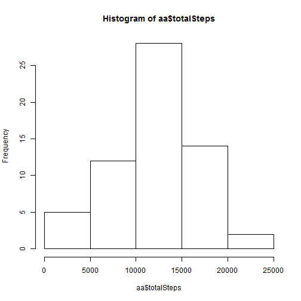

The source data is 
https://d396qusza40orc.cloudfront.net/repdata%2Fdata%2Factivity.zip [52K]

The following code read these data and removes the NA rows.


```r
x<- read.csv("C:/Users/jackc_000/Desktop/r_code/activity.csv")
y<- x[complete.cases(x),]
summary(y)
```

```
##      steps                date          interval     
##  Min.   :  0.00   2012-10-02:  288   Min.   :   0.0  
##  1st Qu.:  0.00   2012-10-03:  288   1st Qu.: 588.8  
##  Median :  0.00   2012-10-04:  288   Median :1177.5  
##  Mean   : 37.38   2012-10-05:  288   Mean   :1177.5  
##  3rd Qu.: 12.00   2012-10-06:  288   3rd Qu.:1766.2  
##  Max.   :806.00   2012-10-07:  288   Max.   :2355.0  
##                   (Other)   :13536
```
## Total Daily Steps
The total steps per day are computed and displayed.

```r
tt<-aggregate(y$steps, by=list(Category=y$date),FUN=sum)
names(tt)<- c("date","totalSteps")
hist(tt$totalSteps)
```

 

The mean and median of the total number of steps per day are provided in the summary

```r
summary(tt)
```

```
##          date      totalSteps   
##  2012-10-02: 1   Min.   :   41  
##  2012-10-03: 1   1st Qu.: 8841  
##  2012-10-04: 1   Median :10765  
##  2012-10-05: 1   Mean   :10766  
##  2012-10-06: 1   3rd Qu.:13294  
##  2012-10-07: 1   Max.   :21194  
##  (Other)   :47
```
## The Average Daily Activity
The mean of the the number of steps per 5 minute interval is calulated and displayed.

```r
i<-aggregate(y$steps, by=list(Category=y$interval),FUN=mean)
plot(i,type="l",ylab="Mean Steps",xlab="Time Interval")
```

 

The five minute interval with the maximum mean is computed

```r
names(i)<-c("interval","averageSteps")
i[which.max(i$averageSteps),]$interval
```

```
## [1] 835
```
## Imputing missing values
The number of rows with missing data is computed.

```r
nrow(x)-nrow(y)
```

```
## [1] 2304
```
The strategy for imputing the missing data is chosen to be a random selection of one of the average mean total steps per interval calculated previously.
A new data set is created with these imputed values included.

```r
a<-x
a$steps[is.na(a$steps)]<-i[sample(1:nrow(i),1),2]
summary(a)
```

```
##      steps                date          interval     
##  Min.   :  0.00   2012-10-01:  288   Min.   :   0.0  
##  1st Qu.:  0.00   2012-10-02:  288   1st Qu.: 588.8  
##  Median :  0.00   2012-10-03:  288   Median :1177.5  
##  Mean   : 40.79   2012-10-04:  288   Mean   :1177.5  
##  3rd Qu.: 57.00   2012-10-05:  288   3rd Qu.:1766.2  
##  Max.   :806.00   2012-10-06:  288   Max.   :2355.0  
##                   (Other)   :15840
```
The total number of steps per day for the new data set with imputed values for the missing data is computed and displayed.

```r
aa <-aggregate(a$steps, by=list(Category=a$date),FUN=sum)
names(aa)<- c("date","totalSteps")
hist(aa$totalSteps)
```

 

The mean and median of total steps per day for these new data is calculated in the summary.

```r
summary(aa)
```

```
##          date      totalSteps   
##  2012-10-01: 1   Min.   :   41  
##  2012-10-02: 1   1st Qu.: 9819  
##  2012-10-03: 1   Median :11458  
##  2012-10-04: 1   Mean   :11749  
##  2012-10-05: 1   3rd Qu.:15084  
##  2012-10-06: 1   Max.   :21194  
##  (Other)   :55
```
The median is slightly smaller and the mean is somewhat smaller. As you can see from the histograms, the distribution has been skewed to the left. Thus, the imputing of missing values with this algorithm decreased the total number of steps taken per day and significantly changed the distribution. 

## Differences Based on Workdays versus Weekend Days
Determine whether the date is a weekday or  weekend and add this factor to the imputed values data set.

```r
weekend <- rep(FALSE,nrow(a))
ab <- cbind(a,weekend)
ab[weekdays(as.Date(ab$date))=="Saturday" | weekdays(as.Date(ab$date))=="Sunday",]$weekend<-TRUE
summary(ab)
```

```
##      steps                date          interval       weekend       
##  Min.   :  0.00   2012-10-01:  288   Min.   :   0.0   Mode :logical  
##  1st Qu.:  0.00   2012-10-02:  288   1st Qu.: 588.8   FALSE:12960    
##  Median :  0.00   2012-10-03:  288   Median :1177.5   TRUE :4608     
##  Mean   : 40.79   2012-10-04:  288   Mean   :1177.5   NA's :0        
##  3rd Qu.: 57.00   2012-10-05:  288   3rd Qu.:1766.2                  
##  Max.   :806.00   2012-10-06:  288   Max.   :2355.0                  
##                   (Other)   :15840
```
The mean of the the number of steps per 5 minute interval is calulated and displayed for both weekends and weekdays in seperate charts on a single panel.

```r
aEnd <- ab[ab$weekend,]
aDay <- ab[!ab$weekend,]
par(mfrow=c(2,1))
aEndI<-aggregate(aEnd$steps, by=list(Category=aEnd$interval),FUN=mean)
aDayI<-aggregate(aDay$steps, by=list(Category=aDay$interval),FUN=mean)
plot(aEndI,type="l",ylab="Mean Steps",xlab="Time Interval",main="Over Weekend")
plot(aDayI,type="l",ylab="Mean Steps",xlab="Time Interval",main="Over Weekdays")
```

 
